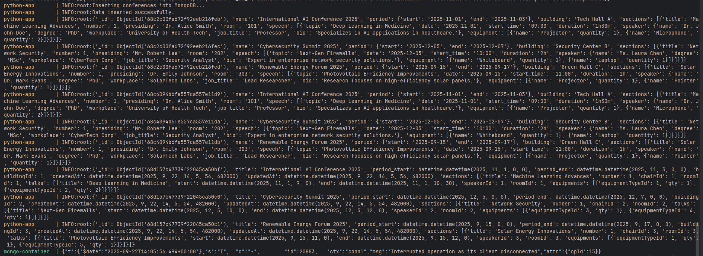
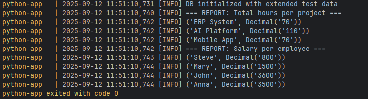

# Databases

### There are two folders for each task:
 - conferences
 - projects_completing

### For each task you need to:
1. Start Docker
2. Change directory in terminal to folder you need:

```cd conferences```

OR 

```cd projects_completing```

3. Run docker-compose.yml:
```aiignore
docker-compose up --build
```

## Under the Hood


# ``conferences/``

- ``db_structure``: schemas of the collections
- ``init_data.py``: 
This script connects to a MongoDB instance, inserts prepared conference data, and logs the results.

Specifically:

Reads MongoDB connection settings (host, port, user, password, database name) from environment variables with default values.

Builds a connection URI and establishes a client with pymongo.MongoClient.

Inserts the data into the ``conferences`` collection of the target database.

Logs confirmation messages and outputs the inserted documents by querying the collection.

## Output example:




## ``projects_completing/``

- ``db_diagram``: UML-diagram of the database
- ``main.py``: 

This script initializes and populates a PostgreSQL database with sample data, then generates summary reports.

Details:

Reads PostgreSQL connection parameters from environment variables with defaults.

Waits until the database is available before proceeding.

Creates tables (``clients``, ``projects``, ``employees``, ``work_reports``) if they do not exist.

Clears all existing data and resets identity sequences.

Inserts predefined sample records for clients, projects, employees, and work reports (10 days of activity).

Generates and logs two reports:

1. Total hours worked per project.

2. Total salary per employee (hours × hourly rate).

Executes initialization and reporting automatically when run as the main program.

## Output example:

