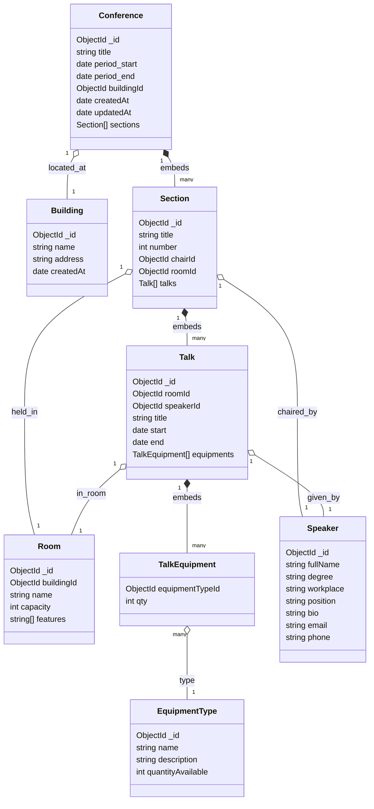

# Embedded Design: Conference System

## Class Diagram

## Notes

- ``TalkEquipment`` represents the ``talks.equipment[]`` embedded array (logical associative entity).
- ``Conferences.period_start`` / ``period_end`` are flattened for indexing; original nested period can be stored and projected as needed.
- Denormalized fields on ``Talk`` (conferenceId, roomId) improve schedule queries and reporting.

## Suggested Key Indexes

- Talks: ``{ conferenceId: 1, start: 1 }``, ``{ roomId: 1, start: 1, end: 1 }``, ``{ speakerId: 1, start: 1, end: 1 }``, ``{ "equipment.equipmentTypeId": 1 }``
- Sections: ``{ conferenceId: 1, number: 1 } (unique), { roomId: 1 }``, ``{ chairId: 1 }``
- Rooms: ``{ buildingId: 1, name: 1 } (unique within building)``
- Conferences: ``{ period_start: 1, period_end: 1 }``, ``{ buildingId: 1 }``